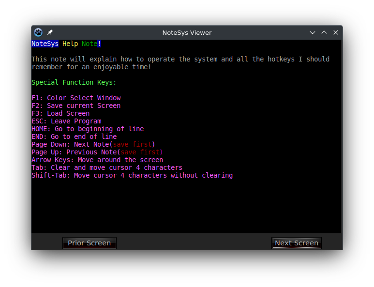

# NoteSys Viewer application for Lazarus

This should compile anywhere any Lazarus application can compile, although you will need my `klib`
Lazarus package which includes the required EGAConsole component.

You may also notice when looking at the code that I didn't use modern ObjectPascal I/O Stream classes,
this is just an example of how portable Pascal is, even from MS-DOS to modern Linux.  The same legacy
methods will still work.  The other thing you will notice is that I didn't use `Inc` or `Dec`, this is
because niether of these can work with properties, and instead I need to grab the value from the
variable to otherwise increment or decrement it.

Here is a screenshot of it running:

