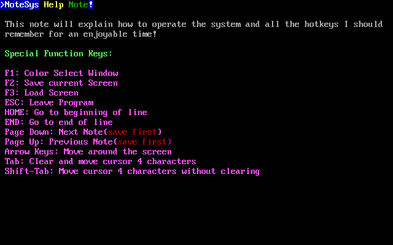

# NoteSys, a full-screen ANSI/ASCII text editor

This is a very basic full-screen editor that saves the *literal* screen buffer from MS-DOS to the
backing file.  The resulting file, while retaining all colours, cannot be loaded into any standard
text editor for editing or review.

You might be asking me, why the heck would anybody do such a thing?

Firstly, why not?  It works perfectly as a notetaking program for MS-DOS, and very specifically MS-DOS,
utilizing how EGA graphics cards store the text buffer in memory.  It will ensure that each note will
always look the exact same on any EGA compatible display you decide to load your notes onto.  It also
overly simplifies the program and file format.  Look at how simple the actual source code is.

